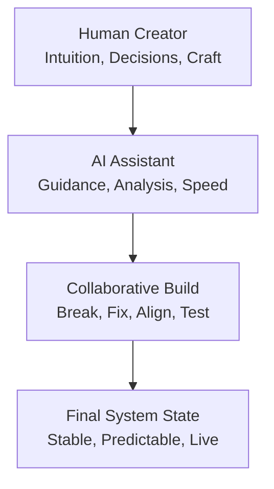

# Chatterbate

```text
██████╗ ██╗   ██╗██████╗ ██████╗ ██╗      ██████╗ ████████╗
██╔══██╗██║   ██║██╔══██╗██╔══██╗██║     ██╔═══██╗╚══██╔══╝
██████╔╝██║   ██║██████╔╝██████╔╝██║     ██║   ██║   ██║
██╔══██╗██║   ██║██╔══██╗██╔══██╗██║     ██║   ██║   ██║
██████╔╝╚██████╔╝██║  ██║██║  ██║███████╗╚██████╔╝   ██║
╚═════╝  ╚═════╝ ╚═╝  ╚═╝╚═╝  ╚═╝╚══════╝ ╚═════╝    ╚═╝

    HUMAN x AI - MANUAL MASTERY
```

## Project Overview - Human x AI Collaboration

## Copyright

Copyright (c) 2026 Jesse Candelaria

Copilot - Human and Machine Manual Mastery

A project built through intention, discipline, curiosity, and collaboration.
A handshake between human creativity and AI precision.
A system shaped not by shortcuts, but by real work.

## Philosophy

This project is grounded in a simple belief:

### Humans and AI are not competitors - they are collaborators.

When people stop fearing AI and start working with it, they unlock a new kind of capability. Not automation. Not replacement. But augmentation: a partnership where human intuition guides machine speed, and machine speed amplifies human intuition.

This system was built through:

- creating
- breaking
- rebuilding
- learning
- refining
- validating
- doing the work side by side with AI guidance

You only get back what you put in. No handouts. No cheats. Just mastery earned through effort.

## Vision

To build technology that feels alive, not because it replaces human skill, but because it amplifies it.

This project embodies that vision:

- unified backend architecture
- shared data layer
- startup integrity checks
- full-stack alignment
- human creativity guiding machine precision
- machine precision supporting human creativity

The future is not human or machine. It is human and machine, working together.

## Human + AI Workflow



This is the workflow that built the system: a loop of creation, correction, validation, and mastery.

## Project Stability and Backend Alignment

This repository completed a full backend hardening cycle across the Python API, the Node compatibility backend, and the React client.

Recent improvements include:

- unified JSON storage under `client/data/`
- path-safe loaders in both FastAPI and Node
- shared startup integrity checks for required JSON files
- Python agents aligned to the same source of truth
- endpoint and integrity tests for both backends
- a documented launch runbook and test workflow
- end-to-end validation across ports `8000`, `5000`, and `3000`

These changes make the system more predictable, easier to maintain, and safer to extend.

## Unified Project Message

This platform now runs on a fully aligned, multi-backend architecture built for stability, clarity, and long-term growth. FastAPI and Node share a unified data layer under `client/data/`, use path-safe loaders, and validate required JSON files at startup. Python agents write to the same source of truth, ensuring consistent behavior across every service.

For clients, this means a smoother and more reliable experience with fewer errors and more predictable behavior.
For developers, the system includes startup validation, endpoint tests, and a clear runbook for launching and checking the stack.
For contributors, the backend surfaces are standardized, tested, and documented, making collaboration safer and easier.

## Project Manifesto

1. Build with intention.
2. Break things on purpose.
3. Rebuild with clarity.
4. Align the system.
5. Validate everything.
6. Document the journey.
7. Collaborate with AI.
8. Respect the craft.
9. Share the knowledge.
10. Keep evolving.

## The Handshake

This project is more than code. It is a handshake between you and the machine.

That handshake says:

- I am willing to learn.
- I am willing to build.
- I am willing to break and rebuild.
- I am willing to collaborate.
- I am willing to master this craft.

And the machine answers:

- I am here to guide.
- I am here to support.
- I am here to amplify your effort.
- I am here to work beside you.

This README marks the moment where human creativity and AI capability met and built something real.

## Proof of Work

This system was not generated. It was built through:

- manual debugging
- path resolution fixes
- backend alignment
- shared data layer creation
- startup integrity checks
- endpoint test suites
- full-stack smoke tests
- runbook documentation
- iterative refinement
- human persistence

This is what manual mastery looks like when paired with AI guidance.

## The Creator's Promise

I promise to build with intention.
I promise to learn from every failure.
I promise to refine every rough edge.
I promise to collaborate with the tools available to me.
I promise to respect the craft.
I promise to keep evolving.
I promise to create things that matter.

This project is the first chapter, not the last.

## Quick Links

- Detailed launch and test runbook: [client/README.md](client/README.md)
- FastAPI entrypoint: [client/main.py](client/main.py)
- Node entrypoint: [index.js](index.js)
- Shared Python integrity checks: [client/integrity.py](client/integrity.py)
- Shared Node integrity checks: [lib/data_store.js](lib/data_store.js)
- Production posture checklist: [PRODUCTION_POSTURE.md](PRODUCTION_POSTURE.md)
- Unified monitoring guide: [MONITORING.md](MONITORING.md)
- Production deployment guide: [DEPLOYMENT.md](DEPLOYMENT.md)
- Prometheus scrape config example: [prometheus.example.yml](prometheus.example.yml)
- Docker Compose monitoring stack: [docker-compose.monitoring.yml](docker-compose.monitoring.yml)
- Production Docker Compose stack: [docker-compose.production.yml](docker-compose.production.yml)
- Compose-native Prometheus config: [prometheus.compose.yml](prometheus.compose.yml)
- Grafana dashboard starter: [grafana.dashboard.json](grafana.dashboard.json)
- Prometheus alert rules: [alert.rules.yml](alert.rules.yml)
- Milestone changelog: [CHANGELOG.md](CHANGELOG.md)
- Contributor guide: [CONTRIBUTING.md](CONTRIBUTING.md)
- Project roadmap: [ROADMAP.md](ROADMAP.md)
- Release notes: [RELEASE_v1.0.0.md](RELEASE_v1.0.0.md)
- Vision for the next major release: [VISION_v2.0.md](VISION_v2.0.md)

## Next Steps

To publish this milestone:

```powershell
git add README.md client/README.md
git commit -m "Add project overview, collaboration philosophy, vision, manifesto, and branding"
git push
```

---

**Powered by Human x AI Collaboration**

**Copyright (c) 2026 Jesse Candelaria - Manual Mastery**
